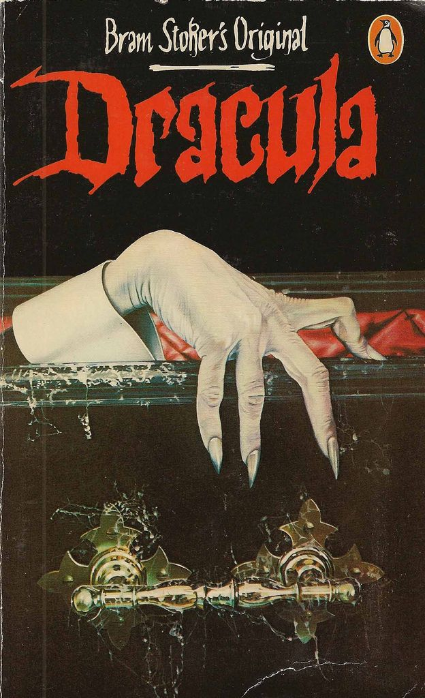
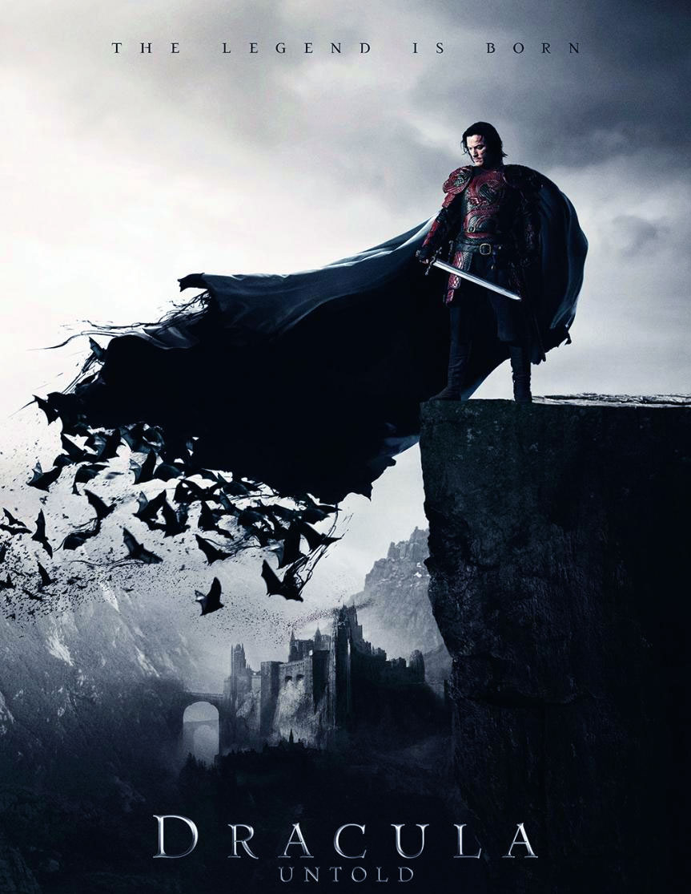

# Linguistica-Webinar-100620

# Come si legge un’immagine? Per una didattica del discorso visivo

## La nostra Classroom
Questo webinar fa parte di una programmazione più ampia, dedicata all’interazione tra linguistica e didattica in classe, e pensata per condividere e sviluppare attività, idee, suggerimenti, e per instaurare uno scambio di esperienze e necessità. Per questo abbiamo creato una piattaforma di discussione online: puoi accedere alla stanza dedicata di <a href="https://classroom.google.com/u/0/" target="_blank">Google Classroom</a>, utilizzando il codice **jdibcze**.
Speriamo che questa diventi un punto di incontro tra tutte le competenze fin qui coinvolte, per poterci scambiare opinioni sulle attività e proposte inedite per temi, metodi e strumenti di lavoro a scuola. 

## Le nostre proposte: attività di annotazione su G-Docs

Vi proponiamo una serie di coppie di immagini per svolgere le attività di annotazione. Trovate tutti i materiali in <a href="https://drive.google.com/drive/folders/1sFHrH9DmzxLmk9xGNnE3TNlLzTSzpMhI" target="_blank">questa cartella</a>. Vi abbiamo inoltre preparato un template unico che potrete riutilizzare per l’analisi dell’immagine che preferite: ricordate di farne prima una copia nella vostra cartella di lavoro! Il template è accessibile a <a href="https://docs.google.com/document/d/1PCVFKw4e0LTb41KfydVf74ajRHSyD7YgspjlNUh-rY8/edit#heading=h.woep0u49atx2" target="_blank">questo link</a>. 
Di seguito una breve descrizione delle immagini che abbiamo scelto. Una volta scelta la coppia ed effettuata l’analisi linguistica multimodale, vi invitiamo a riflettere sui seguenti punti: in che modo le locandine dei film si discostano dalle immagini di copertina dei libri da cui sono state tratte? Ci sono invece degli elementi comuni che l’analisi ha portato alla luce? Se sì, qual è il loro significato? 

### Dracula

 

Vi proponiamo qui tre immagini: la copertina dell’opera di Bram Stoker del 1897 (in edizione Penguin Classics), la locandina del film *Dracula Untold* del 2014 e una gif rappresentante un cartellone pubblicitario della serie **Dracula** prodotta dalla BBC. 

### Sherlock Holmes

Vi proponiamo la copertina del libro di Sir Arthur Conan Doyle e un’immagine tratta dalla serie della BBC *Sherlock* con Benedict Cumberbatch. Quali elementi sono utilizzati per connotare diversamente il personaggio di Sherlock Holmes nelle due immagini?

### Lo Hobbit

Qui trovate la copertina della prima edizione del 1937 del romanzo di J.R.R. Tolkien e la locandina del film *Lo Hobbit - La desolazione di Smaug* del 2013. 

### Io, Robot

Da una parte la copertina della raccolta di racconti di fantascienza di Isaac Asimov del 1950 e dall’altra la locandina del film del 2004 con Will Smith.

### Sulla Strada

Qui invece vi proponiamo la copertina del libro dello scrittore americano Jack Kerouac del 1951 e accanto la locandina del film omonimo uscito nel 2012.

### Il Padrino

Vi proponiamo la copertina del primo romanzo della serie scritto da Mario Puzo nel 1969 e la locandina del film (*Il Padrino - parte prima*) uscito nel 1972.

### La Divina Commedia - Inferno

Qui trovate la copertina dell’Inferno nell’edizione *grandi classici bur* e accanto un’immagine tratta dal videogioco *Dante’s Inferno* del 2010.

### Il Grande Gatsby

Da un lato la copertina del romanzo del 1925 di Francis Scott Fitzgerald e dall’altro la locandina del film uscito nel 2013 con Leonardo di Caprio e Carey Mulligan.

### 1984

Qui abbiamo la copertina del libro di Orwell pubblicato nel 1949 per la Penguin Books e accanto la locandina del film omonimo uscito nel 1984. 

### Il Libro della Giungla 

Infine, vi proponiamo la copertina della raccolta di storie di Rudyard Kipling (1894) e la locandina del film del 2016, a sua volta un *remake* del primo film della Disney del 1967.

## Vuoi saperne di più?

Se l’attività di annotazione con la piattaforma **ThingLink** vi ha incuriosito, potete scrivere direttamente alla nostra docente Annamaria Bove!
